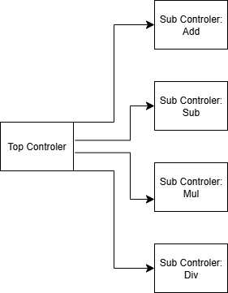

## 개요

사실 처음만해도 무작정 계산기를 만들고 싶다고 생각했을 뿐이다. (만만해 보였던 건 사실)

계산기는 기본적으로 +(덧셈), -(뺄셈), *(곱셈), /(나눗셈)이 가능하고, 

operator들은 input으로 직접 switch 등을 이용해 넣어주며, (FPGA 보드를 가정하고 만들었다.)

어떤 모드를 선택할지도 input으로 받는다.

좀 더 자세하게 i/o를 정해보자면,
 

### I/O

#### | 입력

- 2진수 x와 y를 입력으로 받는다.

- 2의 보수를 따른다.

- x는 8bit, y는 4bit.

    - x와 y는 각각 signed int.

- 각 모드를 선택하는 신호를 받는다.
>ad(덧셈), su(뺄셈), mul(곱셈), div(나눗셈).(sqr(루트)는 미정)

- 리셋 신호(rst)

- st(start)신호.

- clock 신호.

#### | 출력

- 에러 (err / v)
- 결과값 (res)

#### | 자세한 사항

`덧셈`/`뺄셈`/`곱셈`:

x 범위는 다음과 같다.
- 0000 0000 - 0000 1111

y 범위는 다음과 같다.
- 0000 - 1111

`나눗셈`:

x 범위는 다음과 같다.
- 0000 0000 - 1111 1111

y 범위는 다음과 같다.
- 0000 - 1111
 

### Schema(1) - Top Level Block

가장 바깥쪽(top level)에서 calculator module을 살펴보면,

다음과 같다.

이제 lower level들에서 만들어 볼 차례이다.
 

### schema(2) - Controler

우선, 처음 스펙을 정할 땐, 

단순히 덧셈 모듈, 뺄셈 모듈, 나눗셈 모듈, 곱셈 모듈 이렇게 4가지 모듈을 각자 따로 만들 생각이었다.

입력 x, y를 mode 입력에 따라서, 단순히 계산 결과를 바로 출력하는 것이다.

문제는 각 모드 회로에 대해 출력이 각각 존재해야했다. 특히나 err출력도 원했기에, 각 모드 회로마다 출력도 2개씩? 이건 너무 낭비 같았다.

해서, 계산을 담당하는 회로를 따로 만들고, 그 결과를 받아서 출력을 담당하는 controler을 만들고 싶었다.

각 모드 입력은 controler로 들어가고, controler들은 계산을 계산회로에 맡긴 뒤, (조합회로일수도 있고, 순차회로일수도 있고.)

계산회로로부터 결과와 에러 signal을 받아 출력한다. 이때, 출력들을 담당하는 register를 하나 둬서, controler들이 ok 신호를 줬을 때만 결과를 출력하는 것이다.                 

- Add controler

- Sub controler

- Mul controler

- Div controler

그러나, 후에 제곱근 계산기능도 추가하고 싶기도 하고,

또, 연달아 계산(이를테면 곱셈 후 덧셈 등)을 하는 기능을 염두해뒀다. (물론, 언젠가는....) 즉, '확장성'을 고려하고 싶었다. 

예를 들어, 곱셈의 경우, 덧셈 회로도 같이 사용하게 될 텐데, 

덧셈회로는 조합회로기 때문에, 곱셈 중간에 이미 결과를 출력하는 register에 값이 들어가있을 수도 있다.

그러다 덧셈 컨트롤러가 출력 ok signal을 보내버릴 수도 있고, 이런 컨트롤러들 사이를 잡아줄 top controler가 필요했다.

또 다른 경우에는, 곱셈이나 나눗셈의 회로를 바꾸게 될 수도 있고, 추가적인 신호를 output으로 만들 수도 있다. 

이 경우에, 기존의 "error와 result를 출력한다."는 기능만큼은 변하지 않고, 유지되게 하고 싶었기에(그렇게 하면 일일히 해당 controler를 고치면서, 주변까지 고치는 등, 넓은 범위에 걸쳐 고치지 않아도 된다.) 역시 top controler가 필요했다.

- Top controler

    - Add controler

    - Sub controler

    - Mul controler

    - Div controler

top controler가 출력 register들에게 ok signal을 맡고, (err와 result를 출력해도 좋다는 신호)

나머지 div, mul, ad, sub controler들에게 해당 모드의 연산을 수행시킨다. 

그럼 다시 각 mode의 controler들은 주어진 x, y 연산을 수행하는 것이다. (후에 설계하기를, x, y 모두 공용 resgister에 각각 저장 후, controler들에 의해 값을 가져오게 했다.)

controler부의 대략적인 그림은 다음과 같았다.

그렇게 덧셈과 뺄셈, 그리고 곱셈의 경우는 대학강의에서 쓰던 교재를 참고했다. 나눗셈은 나름 자존심 상 곱셈을 참고해서 만들어봤다.

그러다 보니, 덧셈과 뺄셈이 유사하단 걸 새삼 깨닫게 됐다.

더 나아가, 곱셈과 나눗셈도 가능하지 않을까? 생각하던 찰나, 몇 몇 레지스터를 공용으로 쓰고, x축을 기준으로 대칭형태로 만든다면, 유사한 형태로 만들 수 있다는 걸 알게됐다.

곱셈의 경우에는, <-- 방향으로, 나눗셈의 경우에는, --> 방향으로 shift register가 비트를 shift시킨다는 걸 이용했다.

schema는 다음과 같다.

(will be updated soon)

