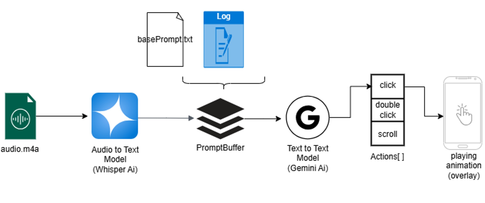

요약: GUI agent를 응용한 스마트폰 화면 네비게이션 앱. (배리어 프리앱)

# 스마트폰 취약 계층을 위한 안내 앱 만들기 프로젝트

학교 캡스톤 디자인 수업에서 프로젝트를 하나 시작했다.

주변 어른들 중 스마트폰을 어려워하시는 분들이 많아 LLM으로 도와주는 앱을 만들고자 했다.

## 동작 설명

기본 동작은 크게 두 가지 모드로 나눌 수 있을 것 같다.

#### 1. 최초 사용자 목표설정 및 루프 모드

이 모드는 사용자의 목표를 음성으로 받기 전, 혹은 사용자의 목표를 막 달성한 상태이다.
- 오버레이된 버튼 겸 아이콘만 화면에 떠있다.

이 상태로 아이콘을 누르면 약 5-6초간 사용자의 음성을 입력받아 STT(Speech-to-Text) model에게 보낸다.
> 모델은 whisper를 사용했다.

STT로부터 받은 응답은 LLM에게 프롬프트의 일부로써 보내게 된다.

*이때!* 프롬프트는 **'시스템 프롬프트' + '사용자 화면 상태(ui state)' + 'LLM이 지시할 수 있는 행동 목록'** 이 들어간다.

LLM으로부터 한줄 지시사항과 함께 행동을 받아오면, 그 행동에 맞는 .gif 이미지를 화면에 띄우는 방식이다.

#### 2. 반복 루프 모드

두 번째 모드는 사용자의 목표가 완료됐다고 LLM이 응답하기까지 반복되는 모드이다.

화면에 띄운 이미지의 유도대로 사용자가 화면을 조작하면, **새로운 ui state가 발생한다고 가정**했기에,

그 다음 LLM응답을 받기위해 마찬가지로 LLM에게 프롬프트를 전송하게 된다.

## 문제와 해결책

사실 이것저것 문제점들이 많았는데, 뒤의 포스팅들에 그때마다의 해결과정들을 써놓았다.

(뒤의 포스팅들을 쓰고 다시 돌아와 작성 중이다....)

(still writing...)

