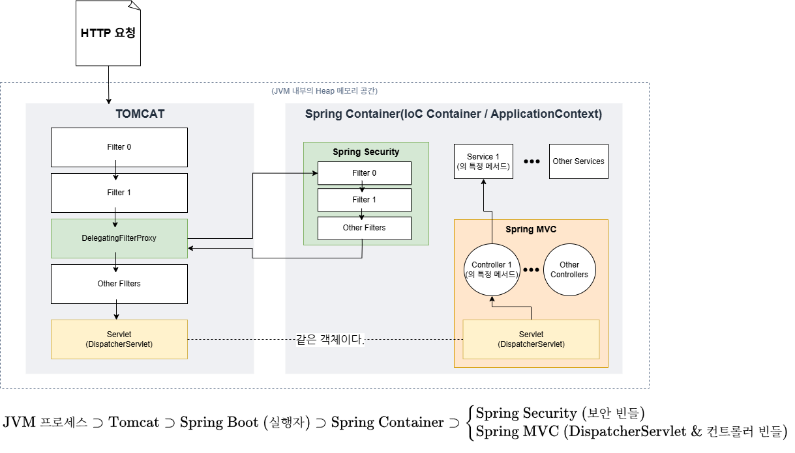
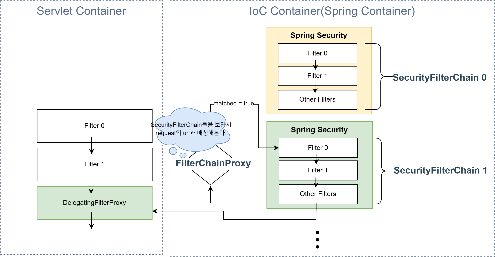

요약: Spring Security란 무엇일까

<details>
<summary>막간 상식</summary>


> jakarta가 뭘까?
> 
> 젬나이의 말에 따르면, 
>
> Oracle에서 처음 JAVA를 만들었을 때는 기술 표준의 이름을 `JAVAX EE`로 지었다. 그 후, Eclipse로 서블릿(Servlet), JSP, JPA 등의 표준 자바 웹 기술들을 넘길 때 `javax` 말고 다른 이름을 쓰도록 했다. (JAVA EE라고 한다.)
> 
> --> 결국 바꾼 이름이 `JAKARTA EE` 때문에 라이브러리 자체도 javax.xx --> jakarta.xx로 바꿨다고 한다.


</details>

# Spring Security란

- Spring에서 `인증`과 `인가`를 위한 기능들을 뜻한다. 물론 api로 제공하고 있다.

    - 여기서 **인증(Authentication)**이란, 사용자가 '누구인지' 확인하는 것을 말하고,
    - **인가(Authorization)**란, 사용자가 '어떤 권한'을 갖는지 정하는 것을 말한다.
    > 예를 들면, 인증은 로그인이고, 인가란 해당 계정이 접근할 수 있는 리소스들(계정 정보조회 등등)을 관리(허용/거부 등)하는 것을 말한다.

- 기본적으로 Spring의 한 부분으로(한 부분이란 말은 Spring에서 공식적으로 제공하는 기능 중 하나란 뜻이다.), Spring Container에서 동작한다.

## Container란

여기서 말하는 **container**는 도커 컨테이너처럼 분리된 실행환경이 아닌,

각종 객체(**Bean**이라 부른다!)를 적절한 시기에 만들고, DI하거나, 생명주기를 관리하는 시스템(프로그램)이다.
- 이런 정의에서는 안드로이드 os도 컨테이너로 봐도 된다.

전통적으로 자바 웹 서버를 담당하던 **서블릿 컨테이너**가 있고, 이를 편리하게 사용하기 위해 나온 'Spring'만의 **Spring 컨테이너**가 있다.
- 대표적인 서블릿 컨테이너로는 '톰캣(Tomcat)'이 있다.

둘은 별개이므로, Spring Container에서 사용하는 개념인 **'빈(Bean)'을 서블릿 컨테이너는 다루지 못한다.**
- 예를 들면, Spring에서는 @Controller 처럼 annotation을 써두면, Spring 컨테이너가 이를 bean으로 만들어(객체 인스턴스) 가지고 있다가, 적절하게 DI하는 등, 알아서 사용해준다. 이를 서블릿 컨테이너는 하지 못한다.

바로 아래에서 이 문제의 해결책을 제시하고 있다.

## Spring Security의 흐름

기본적으로 자바 웹 서버는 사용자 요청에 대해 **서블릿(Servlet)**을 실행하는 구조로 동작한다.

여기서 **서블릿**이란, 자바 프로그램(.java --> .class)으로 사용자 요청에 대응하는 프로그램이 서블릿 컨테이너에 의해 컴파일 된 후, 실행되는 구조이다.

<details>
<summary>더 자세한 서블릿 설명</summary>


</details>

### Filter, doFilter

서블릿 컨테이너는 기존에 사용자 요청 한 개 당 서블릿을 한 개씩 실행했다. 이때, 사용자 요청의 이상탐지 같은 공통적인 일종의 **'필터링'** 기능들을 따로 빼서, 앞단에서 먼저 실행하게 했다. 
- 이때, 필터들은 용도에 따라 여러개가 연달아 존재하고, 이 일련의 필터링 과정을 `FilterChain` 이라고 한다.

[공식문서(SpringSecurity)](https://docs.spring.io/spring-security/reference/servlet/architecture.html)에서 서블릿 컨테이너에서 filtering 기능들, 즉 FilterChain을 활용하는 예시코드를 다음과 같이 소개한다.

```java

@Override
public void doFilter(ServletRequest request, ServletResponse response,
		FilterChain chain) throws IOException, ServletException {
	// do something before the rest of the application
	chain.doFilter(request, response); // invoke the rest of the application
	// do something after the rest of the application
}

```

저 주석 `do something before the rest of the app`에서 원하는 작업을 하게 한 후, 계속해서 다음 필터(chainning에 속한 필터들)에게 FilterChain의 `doFilter`메서드를 통해 넘겨준다.
> ([자바웹표준기술문서에 따르면](https://jakarta.ee/specifications/servlet/4.0/apidocs/javax/servlet/filter) "this method allows the Filter to pass on the request and response to the next entity in the chain."이라고 한다.)
> 
> - 즉, [FilterChain](https://docs.oracle.com/javaee/7/api/javax/servlet/FilterChain.html)은 일련의(chain) filter들을 가리킨다고 보면 된다.

이때, Spring에서는 `DelegatingFilterProxy`란 특별한 필터를 제공한다.
- [공식문서설명](https://docs.spring.io/spring-security/reference/servlet/architecture.html)

```java

public void doFilter(ServletRequest request, ServletResponse response, FilterChain chain) throws IOException, ServletException {
	Filter delegate = getFilterBean(someBeanName);
	delegate.doFilter(request, response, chain);
}

// 1. Lazily get Filter that was registered as a Spring Bean. For the example in DelegatingFilterProxy is an instance of delegateBean Filter0.
// 2. Delegate work to the Spring Bean. (delegate = 대리하다)

```

공식 문서의 pseudo code를 보면, servlet container에서 bean을 실행시키고 있음을 알 수 있다.

정확히는 아래 그림과 같다.

### 서블릿 컨테이너와 스프링 컨테이너를 거치는 전반적인 과정



1. 사용자의 요청(http)이 tomcat으로 들어온다.
2. tomcat에서는 필터링 기능(chain of filters)을 수행한다.
3. 그 중, Spring에서 제공한 `DelegatingFilterProxy`가 `Spring Security`기능으로 이어준다.
    1. Spring Container 안에서는 Bean들이 동작하기 때문에, 이 Spring Security만의 Filter들은 Bean이다.
    2. 사용자 요청은 Bean들(각각의 security filter들)을 거친다.
    3. 모두 통과하면 다시 chain of filters의 나머지 필터로 돌아간다.(서블릿 컨테이너가 인식할 수 있는 다른 나머지 필터들)
4. 최종 필터를 통과한 이후엔 드디어 서블릿을 실행한다.
5. Spring에서는 `DispatcherServlet`이 요청에 맞는(e.g. "/home") controller를 실행함으로써 사용자 요청을 처리한다.
6. 사용자 요청 처리(요청에 맞는 자바 코드 실행) 후, 응답은 이 역순으로 진행된다.

### 예시 코드로 살펴보자.

코드와 함께 이해해보자. 우선, 복잡한 것들은 다 무시하고, SecurityConfig 클래스 아래 @Bean으로 선언된(Spring Container에게 생명주기를 관리받는 객체라는 뜻이다.) `filterChain` 메서드를 주목하자.

해당 메서드는 `SecurityFilterChain` 타입의 객체를 반환한다. 아래 제미나이의 예시코드를 살펴보자.

```java

package com.example.demo.config; 

import org.springframework.context.annotation.Bean;
import org.springframework.context.annotation.Configuration;
import org.springframework.security.config.annotation.method.configuration.EnableMethodSecurity;
import org.springframework.security.config.annotation.web.builders.HttpSecurity;
import org.springframework.security.config.annotation.web.configuration.EnableWebSecurity;
import org.springframework.security.crypto.bcrypt.BCryptPasswordEncoder;
import org.springframework.security.crypto.password.PasswordEncoder;
import org.springframework.security.web.SecurityFilterChain;

@Configuration
@EnableWebSecurity
@EnableMethodSecurity
public class SecurityConfig {
	// 1. 비밀번호를 안전하게 암호화해주는 도구(BCrypt)
    @Bean
    public PasswordEncoder passwordEncoder() {
        // 비밀번호를 데이터베이스에 안전하게 암호화하여 저장하기 위한 인코더
        return new BCryptPasswordEncoder();
    }
    // 2. 어떤 주소는 그냥 통과시키고, 어떤 주소는 로그인을 막을지 결정하는 필터 설정
    @Bean
    public SecurityFilterChain filterChain(HttpSecurity http) throws Exception {
        http
            // 1. 페이지 접근 권한 설정
            .authorizeHttpRequests(auth -> auth
                // 대시보드(/home), 정적 리소스(CSS, JS)는 로그인 없이도 누구나 접근 가능하도록 허용
                .requestMatchers("/home", "/css/**", "/js/**", "/images/**","/bug-report/**").permitAll()
                // 그 외 모든 요청은 로그인이 필요하도록 설정
                .anyRequest().authenticated()
            )
            // 2. 로그인 설정
            .formLogin(form -> form
                .loginPage("/home")             // 커스텀 로그인 페이지를 따로 두지 않고 /home(대시보드)을 로그인 페이지로 활용
                .loginProcessingUrl("/login")   // HTML의 <form action="/login" method="POST">가 던지는 로그인 요청을 가로채서 처리함
                .usernameParameter("username")
                .passwordParameter("password")
                .defaultSuccessUrl("/home", true) // 로그인 성공 시 대시보드로 이동
                .permitAll()
            )
            // 3. 로그아웃 설정
            .logout(logout -> logout
                .logoutUrl("/logout")
                .logoutSuccessUrl("/home") // 로그아웃 성공 시 대시보드로 이동
                .invalidateHttpSession(true)
                .deleteCookies("JSESSIONID")
                .permitAll()
            )
            // 4. 개발 편의를 위한 CSRF 보안 비활성화 
            .csrf(csrf -> csrf.disable());

        return http.build();
    }
}

```

SecurityFilterChain는 [공식문서](https://docs.spring.io/spring-security/reference/api/java/org/springframework/security/web/SecurityFilterChain.html)에 따르면, "Defines a filter chain which is capable of being matched against an HttpServletRequest."라고 한다.

즉, 사용자 http request에 대해 매칭된(사전에 request의 url과 매칭되는 필터묶음을 정의해놓는다.) 필터 chain(일련의 묶음)을 뜻한다.

http는 빌더 패턴으로, 최종적으로 .build() 메서드를 통해 SecurityFilterChain을 반환하게 되는데, 이때 `FilterChainProxy`가 이 SecurityFilterChain의 
- `matches(jakarta.servlet.http.HttpServletRequest request)`
- `getFilters()`

메서드들을 이용해서 각각 사용자의 http request의 url이 '이 SecurityFilterChain과 매칭되는지' 확인하고, true일 때 getFilters로 Filter들을 불러와서 필터링을 하게 되는 것이다. (마찬가지로 doFilter()로 계속 chainning할 것이다.)

"`FilterChainProxy`는 또 뭐지?"라고 궁금할 수 있다.

### FilterChainProxy와 DelegatingFilterProxy

아까 위에서 **DelegatingFilterProxy**가 서블릿 컨테이너의 필터 중 하나로 들어가서, 이 DelegatingFilterProxy의 필터링 차례가 됐을 때, Spring Security의 필터들(Bean)로 연결해준다고 했다.

이때, 더 자세하게 알아보면([공식문서에 따르면](https://docs.spring.io/spring-framework/docs/current/javadoc-api/org/springframework/web/filter/DelegatingFilterProxy.html#invokeDelegate(jakarta.servlet.Filter,jakarta.servlet.ServletRequest,jakarta.servlet.ServletResponse,jakarta.servlet.FilterChain))),  **DelegatingFilterProxy**는 다음과 같은 생성자를 가진다.

```java

DelegatingFilterProxy(jakarta.servlet.Filter delegate)
Create a new DelegatingFilterProxy with the given Filter delegate.

```

jakarta.servlet.Filter는 interface로 **FilterChainProxy**가 그 구현체이다.

즉, DelegatingFilterProxy의 생성자 인자로 FilterChainProxy가 들어간다.

그 후, `invokeDelegate` 메서드를 통해 FilterChainProxy(delegate)의 메서드를 사용하게 된다.

```java
protected void
invokeDelegate(jakarta.servlet.Filter delegate, jakarta.servlet.ServletRequest request, jakarta.servlet.ServletResponse         response, jakarta.servlet.FilterChain filterChain)

//Actually invoke the delegate Filter with the given request and response.

```

제미나이의 더 자세한 예시코드를 보자.

```java

public class DelegatingFilterProxy extends GenericFilterBean {

    // 우리가 설정한 "springSecurityFilterChain"이라는 이름의 Bean(즉, FilterChainProxy)이 여기에 담김
    private volatile Filter delegate; 

    @Override
    public void doFilter(ServletRequest request, ServletResponse response, FilterChain filterChain) {
        
        // [핵심] 바로 이 메서드 안에서 진짜 일꾼(FilterChainProxy)을 깨워!
        invokeDelegate(this.delegate, request, response, filterChain) {
            
            // 톰캣에게 받은 request, response, 원래의 tomcatChain을 
            // FilterChainProxy의 doFilter() 인자로 그대로 패스해 버려! (바톤 터치)
            delegate.doFilter(request, response, filterChain); 
        }
    }
}

```

- (이때, filterchain은 생각해보면 Servlet Container의 filterchain으로, Spring Container의 filterchain은 아니다.)
> 그 이유는 Spring Container에서 Spring security filterchain을 거친 뒤, 다시 마저 남은 Servlet Container의 filterchain으로 돌아가야 하기 때문이다.

그 후, 이번에는 FilterChainProxy(delegate)의 doFilter()의 예시는 아래와 같다.

```java

public class FilterChainProxy extends GenericFilterBean {

    @Override
    public void doFilter(ServletRequest request, ServletResponse response, FilterChain chain) {
        // DelegatingFilterProxy가 넘겨준 request를 분석해서 주소를 매칭함 (RequestMatcher 동작!)
            // --> FilterChainProxy가 Spring Security의 필터들로 이루어진 FilterChainProxy 중 url이 매칭되는 경우에만 사용자 요청을 해당 chain of filter들에게 통과시킨다.
        // 그리고 내부 가상 체인(VirtualFilterChain)을 만들어서 보안 필터들을 가동함.
    }
}

```

*가상체인(VirtualFilterChain)*이란 말이 나왔는데, 별 게 아니고, 톰캣같은 Servlet Container의 Filter chain이 아닌, 중간에 request를 가로채서(?) Spring Container에서 돌아가는 Filter Chain들을 말한다.

VirtualFilterChain에서는 똑같이 필터 chain을 다 통과할 때까지 doFilter()하다가, 다 통과하면 그제서야 다시 톰캣(Servlet Container)의 Filter로 돌려준다.

**결과적으로** FilterChainProxy와 DelegatingFilterProxy의 관계는 아래의 그림과 같다.



제미나이가 그려준 schema가 더 이해가 쉬울 수도 있다. (아래)

```text

[ 톰캣 세상 (서블릿 컨테이너) ]                    [ 스프링 세상 (IoC 컨테이너) ]
┌──────────────────────────────┐                ┌──────────────────────────────────────────┐
│ 톰캣 필터 체인...              |                │                                          │
│      │                       │                │  단 1개만 존재하는 총감독 빈                 │
│      ▼                       │                │  ┌────────────────────────────────────┐  │
│ 🌉 DelegatingFilterProxy     │ invokeDelegate │  │ 🚪 FilterChainProxy (Filter 타입)  │  │
│    (딱 1개 존재)               ├────────────────┼─►│                                    │  │
└──────────────────────────────┘ (req, res,     │  │  품고 있는 매뉴얼 목록:                │  │
                                  tomcatChain)  │  │   - 📑 SecurityFilterChain 1       │  │
                                                │  │   - 📑 SecurityFilterChain 2       │  │
                                                │  └────────────────────────────────────┘  │
                                                └──────────────────────────────────────────┘

```

이때, DelegatingFilterProxy와 FilterChainProxy는 각 1개씩만 존재하고, 

둘을 분리한 이유는 각각 만들어지는 시점이 다르기 떄문이다.

- DelegatingFilterProxy는 Servlet Container(TomCat)이 실행되는 시점에 web.xml 같은 설정파일을 보고 만듦.
- FilterChainProxy는 애초에 Spring Container가 Tomcat이 먼저 구동 된 뒤에 @Component 같은 annotation을 보면서 만드는 Bean 중에 하나.

만약 톰캣이 바로 FilterChainProxy를 filter Chain에 넣었다면, 아직 존재하지도 않은(메모리에 올라오지 않은) 객체를 참조하게 된다.

결과적으로 둘을 따로 만들었기에, Servlet Container와 Spring Container를 분리시킬 수 있다.

## Spring Security를 프로젝트에 적용해보기

### 코드{#exampleCode-section}

우선, com.example.demo 밑에 패키지(폴더)를 하나 만들고 config로 이름을 정한다.

그 후, config 아래에 SecurityConfig.java 파일을 만든다. 코드는 위에서 잠깐 나왔던 코드와 동일한 코드이다.

```java

package com.example.demo.config; 

import org.springframework.context.annotation.Bean;
import org.springframework.context.annotation.Configuration;
import org.springframework.security.config.annotation.method.configuration.EnableMethodSecurity;
import org.springframework.security.config.annotation.web.builders.HttpSecurity;
import org.springframework.security.config.annotation.web.configuration.EnableWebSecurity;
import org.springframework.security.crypto.bcrypt.BCryptPasswordEncoder;
import org.springframework.security.crypto.password.PasswordEncoder;
import org.springframework.security.web.SecurityFilterChain;

@Configuration
@EnableWebSecurity
@EnableMethodSecurity
public class SecurityConfig {
	// 1. 비밀번호를 안전하게 암호화해주는 도구(BCrypt)
    @Bean
    public PasswordEncoder passwordEncoder() {
        // 비밀번호를 데이터베이스에 안전하게 암호화하여 저장하기 위한 인코더
        return new BCryptPasswordEncoder();
    }
    // 2. 어떤 주소는 그냥 통과시키고, 어떤 주소는 로그인을 막을지 결정하는 필터 설정
    @Bean
    public SecurityFilterChain filterChain(HttpSecurity http) throws Exception {
        http
            // 1. 페이지 접근 권한 설정
            .authorizeHttpRequests(auth -> auth
                // 대시보드(/home), 정적 리소스(CSS, JS)는 로그인 없이도 누구나 접근 가능하도록 허용
                .requestMatchers("/home", "/css/**", "/js/**", "/images/**","/bug-report/**").permitAll()
                // 그 외 모든 요청은 로그인이 필요하도록 설정
                .anyRequest().authenticated()
            )
            // 2. 로그인 설정
            .formLogin(form -> form
                .loginPage("/home")             // 커스텀 로그인 페이지를 따로 두지 않고 /home(대시보드)을 로그인 페이지로 활용
                .loginProcessingUrl("/login")   // HTML의 <form action="/login" method="POST">가 던지는 로그인 요청을 가로채서 처리함
                .usernameParameter("username")
                .passwordParameter("password")
                .defaultSuccessUrl("/home", true) // 로그인 성공 시 대시보드로 이동
                .permitAll()
            )
            // 3. 로그아웃 설정
            .logout(logout -> logout
                .logoutUrl("/logout")
                .logoutSuccessUrl("/home") // 로그아웃 성공 시 대시보드로 이동
                .invalidateHttpSession(true)
                .deleteCookies("JSESSIONID")
                .permitAll()
            )
            // 4. 개발 편의를 위한 CSRF 보안 비활성화 (실무에선 활성화하지만 학습용으로는 꺼두는 게 편리합니다)
            .csrf(csrf -> csrf.disable());

        return http.build();
    }
}

```

하나씩 살펴보겠다! 우선 위에 붙은 @(annotation)들의 의미이다.

#### @Configuration, @EnableWebSecurity, @EnableMethodSecurity

**1. @Configuration**

이걸 설명하기에 앞서, Spring에서는 Bean을 등록하는 방법이 두 개로 나뉜다.
1. 자동 등록하기(@Component 계열)
2. 수동 등록하기(@Configuration + @Bean)

자동 등록하기는 @Component 계열, 즉 @Controller나 @Service 등을 내가 만든 자바 클래스 위에 붙이면,

Spring이 알아서 싱글톤 객체로 생성 후, Spring Container에 넣어 생명주기를 관리한다.

반면에 수동 등록은 @Configuration이 붙은 클래스 안에서, 외부 라이브러리의 객체를 직접 생성하는 메서드를 작성한 후 @Bean을 붙여주면,

Spring이 해당 메서드 실행 후 반환된 객체를 Container에 담는다.

Bean 자동 등록과 수동 등록을 비교한 표는 아래와 같다.

|비교 기준|자동 빈 등록 (@Component)|수동 빈 등록 (@Bean)|
|---|---|---|
|등록 대상|내가 직접 만든 클래스 (소스 코드 수정 가능)|"외부 라이브러리 클래스, 또는 특별한 설정이 필요한 클래스"|
|어노테이션 위치|클래스 선언부|@Configuration 클래스 내부의 메서드|
|객체 생성(new) 주체|스프링이 알아서 생성|개발자가 자바 코드로 직접 생성|
|초기화 세팅|불가능 (기본 생성자로 단순 생성만 됨)|가능 (메서드 안에서 setter나 생성자로 값 주입 가능)|
|유지보수성|클래스가 늘어날 때마다 자동으로 등록되므로 편리함|빈이 많아지면 설정 파일 코드가 길어져서 관리가 번거로움|

제미나이가 만들어준 예시코드는 아래와 같다.

```java
// [위치 1] 설정 역할을 할 클래스 위에 붙입니다.
@Configuration
public class MyManualConfig {

    // [위치 2] 객체를 생성해서 반환하는 '메서드' 위에 붙입니다.
    @Bean 
    public ExternalService externalService() {
        // 개발자가 직접 객체를 생성(new)하는 코드를 작성합니다!
        ExternalService service = new ExternalService();
        service.setTimeout(5000); // 초기 설정도 직접 제어 가능
        return service; 
    }
}
```

정리하자면, 

- '데이터 및 자바 설정 관련 애너테이션'이다.
-  해당 클래스가 스프링의 설정을 위한 자바 클래스임을 선언한다. 내부에서 @Bean을 사용해 외부 라이브러리 객체들을 Bean으로 등록한다.
> 즉, 외부 라이브러리 객체들은 Spring이 모르니까 처리할 수 없다. 
> 
> 따라서 보통 @Configuration이 붙은 클래스 안에서, @Bean이 붙은 메서드 형태로 원하는 외부 라이브러리 객체를 반환한다.
> - return하는 객체를 해당 외부 라이브러리 객체로 한다는 것이다.

위 코드로 예시를 들면,

```java
@Configuration        // <----------- 이렇게 @Configuration이 붙은 클래스에서,
// ...
public class SecurityConfig {
	
    @Bean                      // <----------------- 이렇게 @Bean이 붙은
    public PasswordEncoder passwordEncoder() {  // <---- 메서드의 반환 객체가 PasswordEncoder라는 외부라이브러리 객체이다.
        return new BCryptPasswordEncoder();
    }

```
참고로, @Configuration은 단순 @Bean의 빈 등록 이외에도 **싱글톤**으로 만들어주는 의미가 있다.

<details>
<summary>(@Configuration과 singleton 방식 설명)</summary>


> 특히, CGLIB라는 라이브러리에 의해 @Configuration이 붙은 클래스를 상속받은 **'프록시(Proxy) 객체'**를 만들어서 Spring Container에 넣고,
>
> 매번 메서드 호출(Bean 생성을 위한)이 될 때마다 Spring에서 호출을 가로챈 다음(intercept), 만들어둔 프록시 객체를 사용한다. 싱글톤을 만들고 재사용한다는 것이다.
> - [공식문서](https://docs.spring.io/spring-framework/reference/core/beans/java/basic-concepts.html)에 나와 있다.
> - 반대로 @Configuration을 붙이지 않고 @Bean만 쓰면(이를 Lite 모드라고 표현한다.), 매번 빈 객체를 생성하게 된다.


</details>

**2. @EnableWebSecurity**

[공식문서](https://docs.spring.io/spring-security/reference/servlet/integrations/mvc.html#mvc-enablewebsecurity)를 보면,

SpringMVC와 intergration(통합)을 하기 위한 annotation이라고 써있다.
> SpringMVC는 Spring Framework의 여러 모듈(기능 단위)중 하나이고, Spring Security 역시 이 모듈 중 하나이다.

intergration의 의미가 뭔가, 하고 젬나이씨에게 물어봤다.

**Q) Spring MVC와의 Integration(연동)이라는 게 정확히 무슨 뜻인가요?**

- 웹 엔진인 Spring MVC와 보안 엔진인 Spring Security는 서로 다른 모듈이기 때문에, 아무 설정을 안 하면 둘이 따로 놀게 됩니다. 
- @EnableWebSecurity를 켜서 둘을 연동(Integration)한다는 건 다음과 같은 구체적인 편리함을 준다는 뜻입니다.

1. 컨트롤러 매개변수에서 로그인 유저 바로 꺼내기

    스프링 시큐리티가 로그인된 유저 정보를 가지고 있어도, Spring MVC 컨트롤러가 그걸 모르면 코드가 복잡해지겠죠? 

    연동이 되면 컨트롤러 메서드에서 이렇게 바로 꺼낼 수 있습니다.

    ```Java
    @GetMapping("/dashboard")
    public String dashboard(@AuthenticationPrincipal UserDetails user) {
        // Spring MVC 컨트롤러 내부에서 시큐리티가 인증한 유저 정보를 바로 사용!
        return "dashboard";
    }
    ```
2. CSRF 토큰을 스프링 MVC 폼(Form) 태그에 자동으로 심어주기

    스프링 MVC가 HTML 화면을 그릴 때, 스프링 시큐리티의 CSRF 보안 토큰을 자동으로 <form> 태그 안에 숨겨진 필터(_csrf)로 끼워 넣어주는 상호작용이 일어납니다.

3. 스프링 MVC의 비동기(Async) 요청 시 보안 컨텍스트 공유

    컨트롤러에서 비동기 작업(Callable, DeferredResult 등)을 수행할 때, 스프링 시큐리티의 로그인 세션 정보가 비동기 쓰레드로도 안전하게 복사되도록 연동해 줍니다.


**더욱이** [공식문서](https://docs.spring.io/spring-security/site/docs/current/api/org/springframework/security/config/annotation/web/configuration/EnableWebSecurity.html)를 보면,

<details>
<summary>(자세한 과정)</summary>은 생략하고,


> "Add this annotation to an @Configuration class to have the Spring Security configuration defined in any WebSecurityConfigurer or more likely by exposing a SecurityFilterChain bean:"

라고 나와있는데, 정리하자면 이 어노테이션(`@EnableWebSecurity`)을 @Configuration 클래스에 추가하면,
- Spring Security 설정을 **WebSecurityConfigurer**에서 정의한다.
- 더 일반적으로는 SecurityFilterChain 빈을 컨테이너에 등록한다.
> [코드](#exampleCode-section) 아래를 보면 @Bean 밑에 SecurityFilterChain을 반환하는 메서드가 존재하는 것을 확인할 수 있다.

이때, **WebSecurityConfigurer**는 아래와 같이 설명한다.
> - Spring Security의 웹 기반 보안을 수행하는 FilterChainProxy를 만들기 위해 WebSecurity를 사용합니다. 
> - 그런 다음 필요한 빈들을 내보냅니다. 
> - WebSecurityConfigurer를 구현해 Configuration으로 등록하거나, *WebSecurityCustomizer* 빈을 노출(expose)함으로써 *WebSecurity*를 커스터마이징할 수 있습니다. *이 설정은 @EnableWebSecurity를 사용할 때 자동으로 가져와(import)집니다.*"


여기서 **WebSecurity**란,
> The WebSecurity is created by *WebSecurityConfiguration* to create the FilterChainProxy known as the Spring Security Filter Chain (springSecurityFilterChain). The springSecurityFilterChain is the Filter that the DelegatingFilterProxy delegates to."

라고 한다. 실제 문서 메서드를 보면, 
- ~~~`addSecurityFilterChainBuilder`같이 여러 FilterChain을 만들 수도 있다. WebSecurityConfiguration에서 자동 호출하는 메서드이다.~~
- builder 타입으로, `build()`메서드를 통해 **FilterChainProxy를 반환한다.**
- [configuration과 WebSecurity의 차이](#confi-websecurity-dff-section)

**종합하면,** 사용자는 원하는 security 설정을 *WebSecurityConfigurer*에 하고, 이 설정은 *WebSecurityConfiguration*에서 알아서 반영한 뒤, *WebScurity* 빌더를 통해 최종적으로 *FilterChainProxy*를 `build()`한다.

젬나이씨의 요약 schema는 아래와 같다.

```text

[ @EnableWebSecurity ]
        │ (이 어노테이션이 아래 공장장을 불러옴)
        ▼
[ WebSecurityConfiguration ] (공장장)
        │
        ├─▶ 1. [ WebSecurity ] builder 객체를 준비한다.
        ├─▶ 2. 개발자가 준 커스텀 설정(WebSecurityCustomizer 등 <-- 과거에는 WebSecurityConfigurer)을 주입한다.
        │
        ▼ (빌드 시작!)
[ FilterChainProxy ] 객체 탄생! 
(이 녀석의 스프링 빈 이름이 바로 'springSecurityFilterChain' 입니다.)

```

+ 제미나이 말로는 이제 WebSecurityConfigurer는 예전 방식이고(예전에는 이 interface를 상속받은 custom configuration을 만드는 방식으로 custom WebSecurity를 정했다고 한다.), 
- WebSecurity를 커스텀하고 싶다? ➔ WebSecurityCustomizer Bean 등록  
- HTTP 보안 규칙을 정하고 싶다? ➔ SecurityFilterChain Bean 등록  Java//  최신 방식 (Bean 등록 구조)

```java

@Configuration
@EnableWebSecurity
public class ModernSecurityConfig {

    // 더 이상 WebSecurityConfigurer를 구현(상속)하지 않고, 단독 Bean으로 등록!
    @Bean
    public WebSecurityCustomizer webSecurityCustomizer() {
        return (web) -> web.ignoring().requestMatchers("/css/**");
    }
}

```

이렇게 component 기반(Bean 기반)으로 바꿨다고 한다.


</details>

FilterChainProxy를 만든다고 한다!


**3. @EnableMethodSecurity**


(writing...)

---

## + 부록(Append)

1. [Spring Security 공식튜토리얼](https://docs.spring.io/spring-security/reference/servlet/getting-started.html)

2. 본문 중에서 의문이 들 수 있는 점이, SecurityFilterChain을 만들기도 전에 http의 메서드를 보면

    ```java

     http

                // 1. 페이지 접근 권한 설정

                .authorizeHttpRequests(auth -> auth

                    // 대시보드(/home), 정적 리소스(CSS, JS)는 로그인 없이도 누구나 접근 가능하도록 허용

                    .requestMatchers("/home", "/css/**", "/js/**", "/images/**","/bug-report/**").permitAll()

                    // 그 외 모든 요청은 로그인이 필요하도록 설정

                    .anyRequest().authenticated()

                )

    ```

    와 같이 url들("/home", "/css/**", "/js/**", "/images/**","/bug-report/**")에 대해 매칭을 수행하는 것처럼 보인다.

    하지만 이는 '매칭을 설정'해 놓는 것이다. 나중에 request가 들어왔을 때 이렇게 매칭하라는(.requestMathcers()) 메서드인 것이다.

    마친 `authorizeHttpRequests()` 메서드의 공식 문서 설명도 다음과 같다.
    > "Allows restricting access based upon the HttpServletRequest using RequestMatcher implementations (i.e. via URL patterns)."

    공식 문서에 SecurityFilterChain은 interface로 정의됐고, 이 interface의 구현체(implements)는 DefaultSecurityFilterChain라고 써있다.

    제미나이가 쉬운 설명을 위해 이 DefaultSecurityFilterChain을 간단히 코드로 적어보면 아래와 같다고 한다.

    ```java

    // 빌더가 최종적으로 찍어내는 실제 구현체 모양 (DefaultSecurityFilterChain)
    public class DefaultSecurityFilterChain implements SecurityFilterChain {

    private final RequestMatcher requestMatcher; // 👈 1. 빌더가 넣어준 URI 기준 책갈피
    private final List<Filter> filters; // 👈 2. 빌더가 넣어준 보안 필터 묶음

    // 생성자
    public DefaultSecurityFilterChain(RequestMatcher requestMatcher, List<Filter> filters) {
    this.requestMatcher = requestMatcher;
    this.filters = filters;
    }

    @Override
    public boolean matches(HttpServletRequest request) {
    // 실제 유저 요청이 들어왔을 때, 빌더가 넣어줬던 그 기준과 일치하는지 판별!
    return this.requestMatcher.matches(request);
    }

    @Override
    public List<Filter> getFilters() {
    return this.filters;
    }

    ```

    저렇게 final 멤버변수(필드)로 requestMatcher와 filters라는 Filter의 List가 들어있음을 확인할 수 있다.

    [httpsecurity](https://docs.spring.io/spring-security/reference/api/java/org/springframework/security/config/annotation/web/builders/HttpSecurity.html)

3. Configuration과 WebSecurity 차이{#confi-websecurity-dff-section}

    Java 웹 개발, 특히 **Spring Security**를 공부할 때 이 두 단어는 정말 많이 마주치고 또 가장 헷갈리는 부분입니다.

    결론부터 말씀드리면, **WebSecurity**는 보안을 적용할 '대상과 큰 틀'을 결정하는 것이고, **Configuration**은 그 틀 안에서 '어떻게 보안을 처리할지 구체적인 규칙'을 설정하는 행위나 클래스를 말합니다.

    공식 문서의 개념을 바탕으로 쉽게 풀어서 설명해 드릴게요.

    ---

    ## 1. WebSecurity (웹 보안의 큰 틀)

    Spring Security 공식 문서에서 `WebSecurity`는 **웹 기반 보안을 설정하기 위한 최상위 가리개(Filter)** 역할을 합니다.

    쉽게 비유하자면, 우리 건물(웹 애플리케이션)에 들어오는 사람들을 검사하는 ‘정문 보안 요원’과 같습니다. 어떤 요청은 아예 검사조차 안 하고 통과시킬지, 어떤 요청은 검사대(Spring Security Filter Chain)로 보낼지를 결정합니다.

    * **공식 문서에서의 핵심 역할:** 보안이 **필요 없는** 정적 자원(CSS, JavaScript, 이미지 등)을 Spring Security의 영향권에서 완전히 제외(`ignoring()`)할 때 주로 사용됩니다.
    * **비유:** "여기 이미지 파일이랑 CSS 파일은 위험하지 않으니 검사 안 하고 그냥 들여보낼게요!"라고 정문에서 프리패스해 주는 것과 같습니다.

    ---

    ## 2. Configuration (보안 설정)

    `Configuration`은 영어 단어 뜻 그대로 '설정'입니다. Spring Security에게 "우리 서비스의 보안 규칙은 이렇게 해줘"라고 지시서(Configuration Class)를 작성하는 행위입니다.

    Spring Security 5.7 버전 이후 공식 문서에서는 `SecurityFilterChain`을 빈(Bean)으로 등록하는 방식을 권장하고 있습니다. 이 설정 안에서 구체적인 규칙을 정하게 됩니다.

    * **공식 문서에서의 핵심 역할:** 특정 URL 경로에 대한 권한 체크, 로그인 페이지 설정, 로그아웃 처리, CSRF 보호 활성화 등을 코드로 구현하는 곳입니다.
    * **비유:** 검사대에 들어온 사람들을 어떻게 처리할지 적힌 ‘보안 매뉴얼’입니다.
    * `/admin` 경로로 가려는 사람은 관리자증(Role)이 있는지 검사해라.
    * 로그인이 안 된 사람은 `/login` 페이지로 보내라.


    ---

    ## 💡 한눈에 비교하기

    | 개념 | 비유 | 공식 문서에서의 주 역할 | 헷갈리지 않는 팁 |
    | --- | --- | --- | --- |
    | **WebSecurity** | **정문 프리패스 지정관** | Security 필터 자체를 적용할지 말지 큰 틀에서 결정 (`ignoring()`) | "이 요청은 Security를 **거칠까? 말까?**" |
    | **Configuration** | **상세 보안 매뉴얼 작성** | 필터를 거치기로 한 요청들의 구체적인 규칙 설정 (로그인, 권한 등) | "필터를 거치는 요청들을 **어떻게 검사할까?**" |

    ---

    ## 💻 코드로 보는 차이점

    실제 Spring Security 설정 코드(Configuration)를 보면 이해가 훨씬 쉽습니다.

    ```java
    @Configuration
    @EnableWebSecurity // 웹 보안을 활성화하겠다는 선언
    public class SecurityConfig {

        // 1. WebSecurity Customizer (WebSecurity 설정)
        // Spring Security 필터 자체를 타지 않게 감싸는 큰 틀의 설정입니다.
        @Bean
        public WebSecurityCustomizer webSecurityCustomizer() {
            return (web) -> web.ignoring()
                .requestMatchers("/css/**", "/js/**", "/images/**"); // "얘네는 아예 검사하지 마!"
        }

        // 2. SecurityFilterChain (구체적인 Configuration)
        // 검사대(필터) 안으로 들어온 요청들을 어떻게 처리할지 상세 매뉴얼을 적는 곳입니다.
        @Bean
        public SecurityFilterChain filterChain(HttpSecurity http) throws Exception {
            http
                .authorizeHttpRequests((auth) -> auth
                    .requestMatchers("/admin/**").hasRole("ADMIN") // 관리자만 가능
                    .requestMatchers("/login", "/signup").permitAll() // 누구나 접근 가능
                    .anyRequest().authenticated() // 나머지는 로그인 필요
                )
                .formLogin((form) -> form
                    .loginPage("/login") // 커스텀 로그인 페이지 설정
                );

            return http.build();
        }
    }

    ```

    > **요약하자면:**
    > `@Configuration`이라는 설정 클래스(매뉴얼)를 만들고, 그 안에서 `WebSecurity` 관련 설정으로 **검사 안 할 영역**을 골라내고, `HttpSecurity` 설정을 통해 **검사할 영역의 규칙**을 촘촘하게 짜는 것입니다.

    처음에는 이 구조가 복잡해 보이지만, "아예 보안을 안 타게 할 것(WebSecurity)"과 "보안을 타되 규칙을 다르게 할 것(Configuration)"으로 머릿속에서 서랍을 나누어 정리하시면 훨씬 이해하기 편하실 거예요!